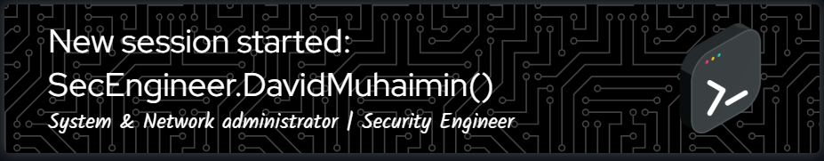

## About Me

Hi, I’m **David Muhaimin** — a passionate learner in the world of **Cyber Security**.  
Currently sharpening my skills through personal projects, bootcamps, and certifications.  
From securing systems to breaking them (ethically), I love exploring both sides of the digital battlefield.

### What I Focus On
- Blue Team operations (Defensive Security, SOC)
- Linux Server Hardening & Monitoring
- Network Security & Basic Penetration Testing
- SysAdmin fundamentals (LAMP stack, Fail2ban, UFW, etc.)

<h3 align="left">Social Media</h3>

###

  
  
  

###

<h3 align="left">Language and tools</h3>

###

  
  
  
  
  
  
  
  
  
  
  
  
  
  
  
  
  
  
  
  
  
  
  
  
  
  
  
  
  
  
  
  
  
  
  
  
  

###

<h3 align="left">My Stats :</h3>

###

  

###

<picture>
  <source media="(prefers-color-scheme: dark)" srcset="https://raw.githubusercontent.com/davidmuhaimin/davidmuhaimin/output/pacman-contribution-graph-dark.svg">
  <source media="(prefers-color-scheme: light)" srcset="https://raw.githubusercontent.com/davidmuhaimin/davidmuhaimin/output/pacman-contribution-graph.svg">
  
</picture>

###

  

###
